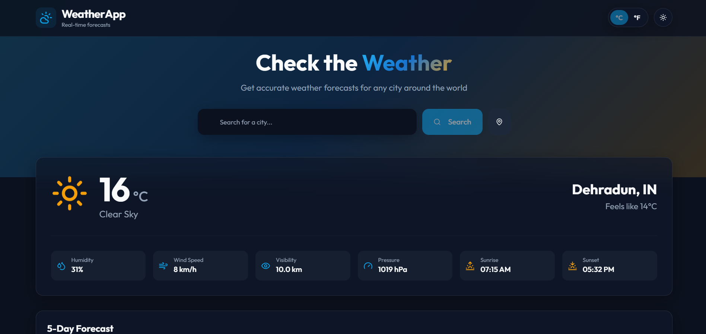
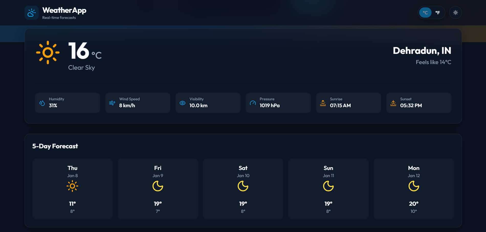
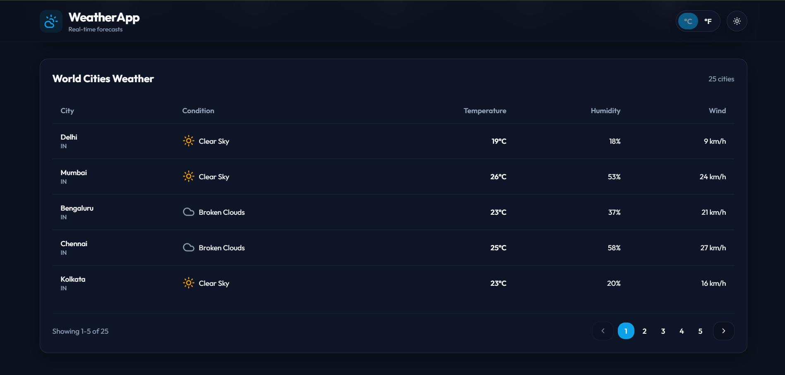
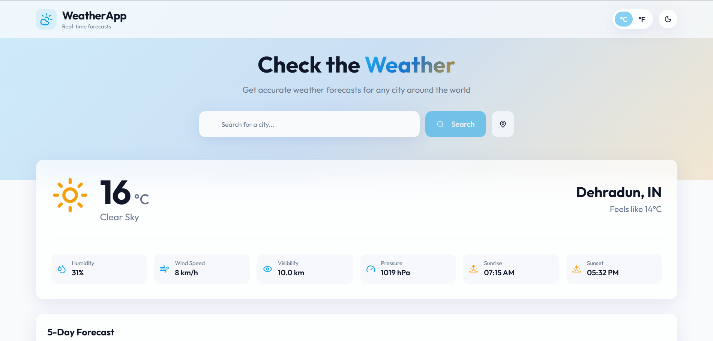

# 🌦️ Weather Companion

A modern, responsive **Weather Web Application** built with **Next.js** and **TypeScript**, providing real-time weather information, 5-day forecasts, and location-based updates with a clean, glassmorphism-inspired UI.

---

## ✨ Features

- 🔍 **City-based Weather Search**
- 📍 **Auto-detect User Location**
- 🌡️ **Temperature Unit Toggle (°C / °F)**
- 🌙 **Dark / Light Mode**
- 📊 **5-Day Weather Forecast**
- 🏙️ **Popular Cities Weather Table**
- ⚡ **Fast Loading with Skeleton Loaders**
- 🚨 **Graceful Error & Loading States**
- 🎨 **Pixel-perfect UI with Tailwind CSS**
- 🌐 **Fully Responsive Design**

---

## 🖼️ Screenshots

> _A quick look at the UI and key features of the application._

### 🌤️ Home / Weather Overview


### 🔍 Forecast


### 📊 Cities Details


### 🌙 Light Mode


---

## 🛠️ Tech Stack

### Frontend
- **Next.js (App Router)**
- **React 18**
- **TypeScript**
- **Tailwind CSS**
- **shadcn/ui**
- **Radix UI**

### State & Data
- **@tanstack/react-query** – data fetching & caching
- **OpenWeatherMap API** – weather data

### UI & Utilities
- **Recharts** – charts & visualizations
- **Embla Carousel** – smooth carousels
- **react-day-picker** – calendar support
- **next-themes** – theme handling
- **Lucide Icons**

---

## 📁 Project Structure

```env
src/
├── app/ # Next.js App Router
├── components/ # Reusable UI components
│ └── ui/ # shadcn/ui components
├── hooks/ # Custom React hooks
├── lib/ # Utility functions
├── types/ # TypeScript types
└── styles/ # Global styles

```

---

## 🔐 Environment Variables

Create a `.env.local` file in the root directory:

```env
NEXT_PUBLIC_OPENWEATHER_API_KEY=your_api_key_here
NEXT_PUBLIC_DEFAULT_COUNTRY=IN
Get your API key from: https://openweathermap.org/api

```

---

🧑‍💻 Getting Started Locally

```env
# Install dependencies
npm install

# Run development server
npm run dev

# Build for production
npm run build

# Start production server
npm start

```

## 🌍 Deployment

The application is deployed on **Vercel**.

---

## 👤 Author

**Ayush Juyal**  
Software Developer
